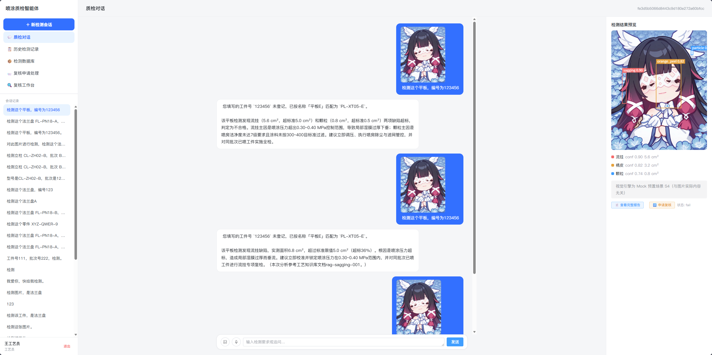
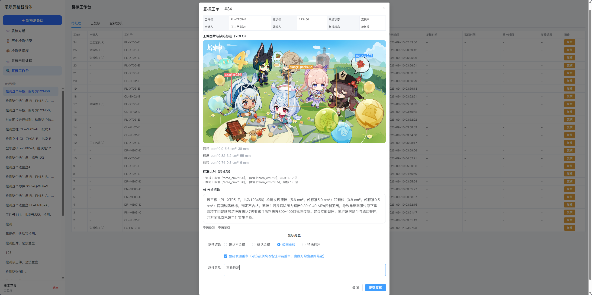
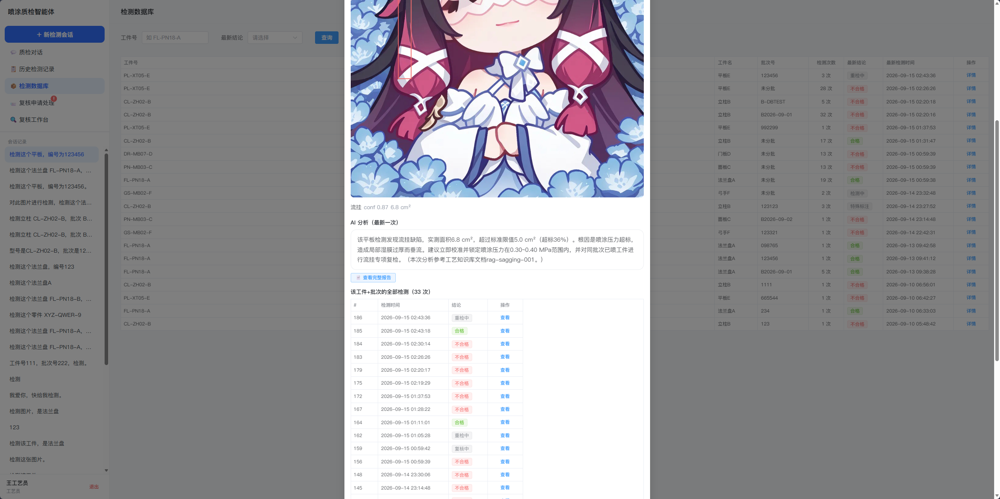
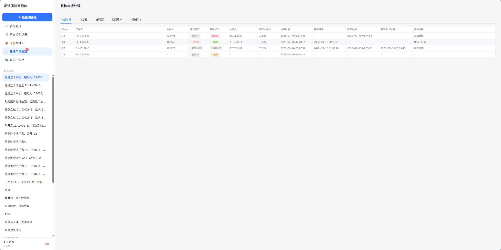
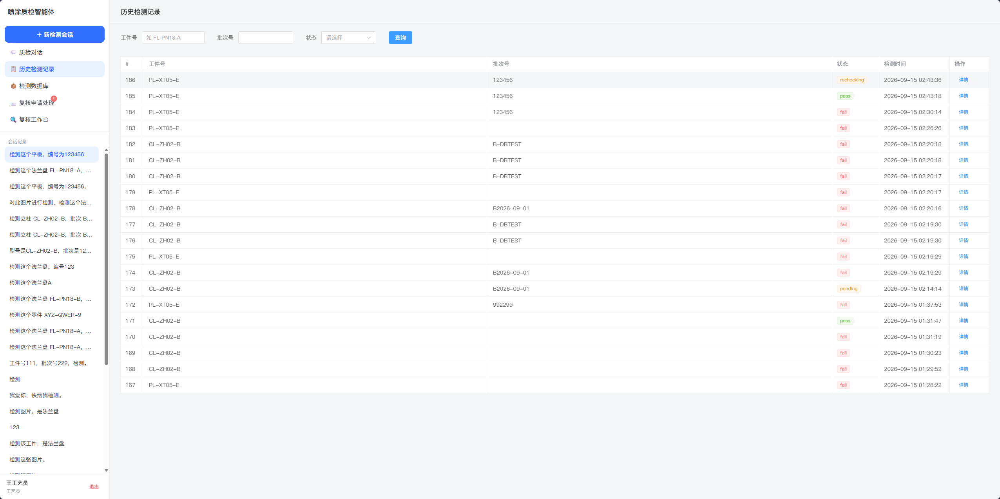
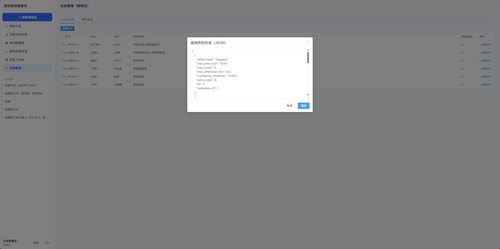
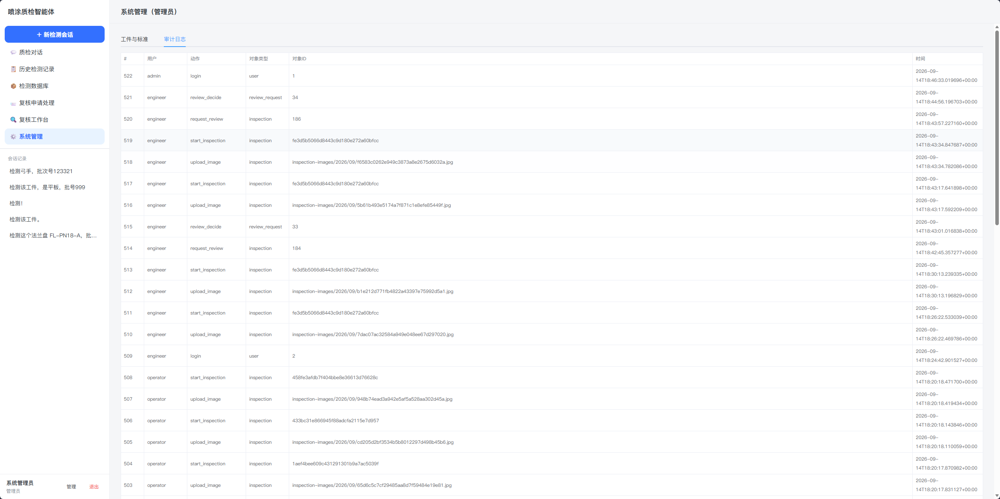

<div align="center">

# 喷涂机器人作业后工件质量检测与评估智能体

**Spray-Coating Quality Inspection Agent · V1.1**

上传喷涂后的工件照片，AI 自动完成 **缺陷检测 → 标准比对 → 工艺知识检索 → 根因分析 → 防幻觉自检 → 报告归档** 全链路，并以流式对话 + 缺陷框叠加界面呈现。


</div>

---

## 界面预览

| 质检对话（缺陷框叠加 + 流式结论） | 复核工作台（全信息复核） |
| :---: | :---: |
|  |  |

| 检测数据库（按工件+批次去重） | 复核申请处理（被驳回强提醒） |
| :---: | :---: |
|  |  |

<details>
<summary>更多界面（历史记录 / 系统管理 / 审计日志）</summary>

| 历史检测记录 | 系统管理 · 工件与标准 | 审计日志 |
| :---: | :---: | :---: |
|  |  |  |

</details>

---

## 核心能力

| 能力 | 说明 |
| --- | --- |
| 🧠 智能工件解析 | 工件号精确输入 / 名称匹配（"法兰盘A"）/ 笔误自动纠正；不合规输入给填报指引，不污染数据 |
| 🤖 检测智能体 | LangGraph 编排：CV 检测 → 结构化阈值比对 → RAG 工艺检索 → LLM 根因分析与整改参数 → 报告归档 |
| 🛡️ 防幻觉自检 | 5 条硬规则（结论一致性/缺陷对应/参数溯源/数值溯源/禁模糊词），不过自动回流重生成 |
| 📦 检测数据库 | 按（工件号+批次）去重的质检知识库：最新结论、检测次数、全程时间线 |
| 🔄 复核工单闭环 | 五态流转（待复核→已复核/被驳回→驳回重审），驳回重审不得再驳回；特殊标注库支持线下核实后改写 |
| 👥 三角色权限 | 操作工 / 工艺员 / 管理员，后端字段级裁剪（操作工无量化数据与工艺参数） |
| 🔌 Mock ↔ 真实可切换 | CV/RAG/LLM 三层 Provider 抽象，`.env` 一键切换（Mock 离线跑通全链路 / 通义千问 / 预留本地 32B） |

## 系统架构

```
Vue3 + Element Plus ──SSE流式──► FastAPI ──► LangGraph 质检图（9 节点）
                                      │            │
                              Provider 抽象层    自检硬规则
                              (CV/RAG/LLM)          │
                                      ▼            ▼
                    PostgreSQL 16 │ Redis-Stack │ MinIO
                    (业务/工单)    (会话+向量)   (图片/报告)
```

---

## 🚀 快速运行（从 GitHub 下载后）

> 前置：**Docker**（含 Compose）、**uv**、**Node.js ≥20**。Windows 详细安装见 [部署指南_Windows](docs/部署指南_Windows.md)，Linux 服务器（systemd+Nginx）见 [部署指南_Linux](docs/部署指南_Linux.md)。

**1️⃣ 克隆并启动基础设施**

```bash
git clone https://github.com/<你的用户名>/spray-qc-agent.git
cd spray-qc-agent
docker compose -f deploy/docker-compose.yml up -d   # PG + Redis + MinIO
```

**2️⃣ 初始化后端**

```bash
cd backend
uv sync                                # 自动创建 .venv（Python 3.12）
cp .env.example .env                   # 默认 Mock 模式无需密钥即可跑通全链路
uv run python scripts/init_db.py       # 建表 + 种子数据
uv run python scripts/init_buckets.py  # MinIO 私有桶
uv run python scripts/seed_mock_data.py
```

**3️⃣ 启动服务**

```bash
uv run uvicorn app.main:app --host 127.0.0.1 --port 8000   # 后端
```

```bash
cd ../frontend
npm install && npm run dev             # 前端 → http://localhost:5173
```

**4️⃣ 登录体验**（演示账号）

| 账号 | 密码 | 角色 |
| --- | --- | --- |
| `operator` | `Operator@123` | 操作工 |
| `engineer` | `Engineer@123` | 工艺员 |
| `admin` | `Admin@123` | 管理员 |

试试输入：`检测立柱 CL-ZH02-B，批次 B2026-09-01` → 观察缺陷叠框与流式结论 → 申请复核 → 切工艺员到「复核工作台」处置 → 「检测数据库」查看去重结论。

<details>
<summary>🔑 接入真实大模型（通义千问）</summary>

编辑 `backend/.env`：

```env
LLM_PROVIDER=qwen
QWEN_API_KEY=sk-你的密钥
# 公网 DashScope 保持默认；专属推理端点需填对应地址：
# QWEN_BASE_URL=https://xxxx.cn-beijing.maas.aliyuncs.com/compatible-mode/v1
```

连通性自检：`uv run python scripts/check_providers.py`（三项 ✅ 即配置成功）。
密钥只存于 `.env`（已被 .gitignore 排除），**严禁提交仓库**。

</details>

<details>
<summary>🧪 质量验证命令</summary>

```bash
cd backend
uv run pytest                                              # 单元测试
CV_MOCK_MODE=match LLM_PROVIDER=mock uv run python scripts/run_eval.py    # S1-S6 评测回归
CV_MOCK_MODE=match LLM_PROVIDER=mock uv run python scripts/smoke_api.py   # API 端到端冒烟
```

</details>

<details>
<summary>🎭 Mock 场景速查（CV_MOCK_MODE=match 时按下表，默认随机抽取）</summary>

| 场景 | 触发工件号 | 预期结论 |
| --- | --- | --- |
| S1 合格件 | FL-PN18-A | ✅ pass |
| S2 流挂超标 | CL-ZH02-B | ❌ fail（6.8cm² > 5.0） |
| S3 色差超标 | PN-MB03-C | ❌ fail（ΔE 2.1 > 1.5） |
| S4 多缺陷 | DR-MB07-D | ❌ fail（三缺陷） |
| S5 低置信度 | PL-XT05-E | ❌ fail（保守判定） |

</details>

---

## 📚 文档导航

| 文档 | 内容 |
| --- | --- |
| [开发文档 V1.0](docs/开发文档_V1.0.md) | 系统设计：架构 / LangGraph 状态机 / 数据库 DDL / API 契约 / 路线图 |
| [V1.1 项目说明](docs/V1.1项目说明.md) | **全部代码文件职责备注** + 调试指引 + 已知坑（二次开发必读） |
| [部署指南 · Windows](docs/部署指南_Windows.md) | 日常启动速查 + Windows 从零部署 |
| [部署指南 · Linux](docs/部署指南_Linux.md) | Ubuntu 从零部署 + systemd 常驻 + Nginx 托管 |

## 目录结构

```
spray-qc-agent/
├── deploy/docker-compose.yml   # PG16 + Redis-Stack + MinIO 一键起
├── backend/                    # FastAPI + LangGraph 后端
│   ├── app/
│   │   ├── graph/              # 质检图（9 节点：解析/CV/比对/RAG/推理/自检/报告/复核/问答）
│   │   ├── providers/          # CV/RAG/LLM 三层 Provider（Mock↔真实切换）
│   │   ├── services/           # SSE 编排/比对/单据/复核工单/存储/审计
│   │   ├── api/                # REST + SSE 路由（9 模块）
│   │   └── core/ models/ schemas/ prompts/
│   ├── scripts/                # 初始化/种子/评测/冒烟/诊断
│   └── tests/                  # pytest
├── frontend/                   # Vue3 + Element Plus（7 页面）
├── mock_data/                  # CV Mock 场景 + 工艺知识语料
└── docs/                       # 设计文档 + 项目说明 + 三份部署指南 + 界面截图
```

## ❓ 常见问题

| 问题 | 答案 |
| --- | --- |
| 对话报 401 鉴权失败 | `QWEN_API_KEY` 与 `QWEN_BASE_URL` 不匹配：专属端点 key 必须配对应端点；改后重启并跑 `check_providers.py` |
| 检测很慢 | 真实 LLM 单次检测 30~90 秒属正常（有超时保护）；演示求快切 `LLM_PROVIDER=mock` |
| 前端改了不生效 | 重启 `npm run dev`（必要时 `--force`） |
| 想跑确定性回归 | 加前缀 `CV_MOCK_MODE=match LLM_PROVIDER=mock`（详见项目说明 §7.1） |

---

> 🔒 **密钥安全**：修改密钥位置为 `backend/.env`。Mock 模式零密钥即可完整体验全部功能。
